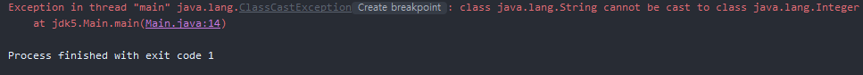

# JDK 업데이트 정리 - 1

JDK 5 업데이트 내용


## 1.  Generics

클래스 내부에서 사용하는 데이터 타입을 객체가 생성될 때 지정하는 기법을 의미합니다. 컴파일 시에 미리 타입 체크가 이루어지기 때문에 실행 시 타입 에러를 방지하고 타입 변환 생략이 가능합니다.

JDK 5 이전 버전에서는 JAVA의 최상위 클래스인 Object를 사용했습니다. 다음과 같은 경우에서는 강제 형변환을 해야 해서 번거롭지만 오류는 발생하지 않습니다.

```java
public class CustomList1 {
    private int size;
    private Object[] data = new Object[10];

    public void add(Object o){
        data[size++] = o;
    }

    public Object get(int index){
        return data[index];
    }
}
```

```java
public static void main(String[] args) {
    CustomList1 list1 = new CustomList1();
    list1.add(1);

    Integer result = (Integer) list1.get(0);
    System.out.println(result);
}
```


하지만 이 방식에는 문제점이 있습니다. Object를 사용하면 모든 타입을 처리할 수 있기 때문에 의도하지 않은 타입이 저장될 수 있고, 어떤 타입으로 형변환 할 지 모호하기 때문에 오류의 원인이 될 수 있습니다.

다음과 같은 경우 String을 Integer로 변환하려 했기 때문에 오류가 발생했습니다. 이런 오류는 컴파일 시점에서 발생하지 않습니다.

```java
public static void main(String[] args) {
    CustomList1 list1 = new CustomList1();
    list1.add("1");

    Integer result = (Integer) list1.get(0);
    System.out.println(result);
}
```



이런 문제를 해결하기 위해 타입 별로 클래스를 작성하게 되면 수많은 중복 코드가 생기게 됩니다.

제네릭을 사용해 객체가 생성될 때 T의 위치에 지정한 타입이 대체되기 때문에 중복된 코드를 줄일 수 있습니다.

```java
public class CustomList2<T> {
    private int size;
    private Object[] data = new Object[10];

    public void add(T value){
        data[size++] = value;
    }

    public T get(int index){
        return (T) data[index];
    }
}
```

```java
public static void main(String[] args) {
    CustomList2<Integer> customList2 = new CustomList2<Integer>();
    customList2.add(1);
    customList2.add("1");   //컴파일 에러 발생

    Integer result = customList2.get(0);
    System.out.println(result);
}
```

다음과 같이 객체를 생성하면 T의 위치에 Integer가 들어가서 데이터 추가 시 Integer가 아닌 값이 들어가면 컴파일 시점에 에러가 발생해 에러를 미리 방지할 수 있고, 데이터를 받을 때마다 강제 형변환을 할 필요도 없어집니다. T 타입은 해당 블럭 안에서만 유효합니다.

---


## 2. Annotation

흔히 보이는 @Override와 같이 클래스, 메소드 또는 변수에 붙어 소스 코드에 메타 데이터를 주는 것입니다. 기존 버전에서는 소스코드와 설정 파일이 따로 존재했었는데 Annotation을 통해 소스 코드에 설정 정보를 추가해서 설정 파일을 공유하는 번거로움이 없이 정보를 제공할 수 있습니다.

```java
@Target(ElementType.METHOD)
@Retention(RetentionPolicy.SOURCE)
public @interface Override {
}
```

다음은 JAVA에서 기본으로 제공하는 어노테이션 중 하나입니다. 어노테이선 내부에도 어노테이션이 있는 모습을 볼 수 있는데, 이는 메타 어노테이션(Meta Annotation)이라고 합니다. 메타 어노테이션은 어노테이션을 만들 때 사용하는 어노테이션입니다.


#### 기본 어노테이션

JAVA에서 기본으로 제공하는 어노테이션입니다.

##### 1. @Override

- 선언한 메서드가 오버라이드 되었다는 것을 알립니다.

##### 2.  @Deprecated

- 메서드가 더 이상 사용되지 않음을 알립니다.

##### 3. @SuppressWarnings

- 컴파일 경고를 무시합니다.

##### 4. @SafeVarags(JDK 7)

- 제네릭 가변인수를 사용할 때의 경고를 무시합니다.

#####  5. @FunctionalInterFace(JDK 8)

- 함수형 인터페이스라는 것을 알립니다.


#### 메타 어노테이션의 종류

##### 1. @Retention

- 어노테이션이 유지되는 기간을 지정합니다.
  * SOURCE : 컴파일 전까지 유효
  * CLASS : 컴파일러가 클래스를 참조할 때까지 유효
  * RUNTIME : 컴파일 이후에도 사용 가능

##### 2.  @Target

* 어노테이션이 적용 될 위치를 지정합니다
  * PACKAGE : 패키지 선언
  * TYPE : 타입 선언(클래스, 인터페이스, enum)
  * ANNOTATION_TYPE : 어노테이션 타입 선언
  * CONSTRUCTOR : 생성자 선언
  * FIELD : 멤버 변수 선언
  * LOCAL_VARIABLE : 지역 변수 선언
  * METHOD : 메서드 선언
  * PARAMETER : 전달인자 선언
  * TYPE_PARAMETER : 전달인자 타입 선언(JDK 9)
  * TYPE_USE : 타입이 사용되는 모든 곳(JDK 8)

##### 3. @Documemted

- javadoc으로 작성한 문서에 포함시킵니다.

##### 4. @Inherited

- 어노테이션의 상속을 가능하게 합니다.

##### 5. @Repeatable(JDK 8)

- 연속적으로 어노테이션을 선언할 수 있게 합니다.


```java
public @interface SampleAnnotation {
    SampleEnum color();
    int primitive();
    String str();
    int[] arr();
}
```

다음과 같이 interface 앞에 @를 붙혀 만들 수 있습니다. 어노테이션 내부에 필드 선언할 수 있는데 원시 타입(int, double, ...), String, 원시 타입 배열, enum이 들어갈 수 있습니다. 

---


## 3.  Auto Boxing/Unboxing

이걸 알아보기 전에 우선 Wrapper class에 대해서 알아봅시다. Wrapper class는 원시 타입의 데이터를 객체로 취급해야 할 때 원시 타입의 데이터를 객체로 감싸주는 클래스입니다. 자바의 원시 타입에 대한 Wrapper class는 다음과 같습니다.

| 원시 타입 | Wrapper class |
| :-------: | :-----------: |
|   byte    |     Byte      |
|   short   |     Short     |
|    int    |    Integer    |
|   long    |     Long      |
|   float   |     Float     |
|  double   |    Double     |
|   char    |   Character   |
|  boolean  |    Boolean    |

원시 타입을 Wrapper class로 변환하는 과정을 Boxing이라고 하고, 반대로 Wrapper class 내부의 저장된 값을 원시 타입 데이터로 꺼내는 과정을 Unboxing이라고 합니다.

```java
Integer w1 = new Integer(1);   //Boxing
int p1 = w1.intValue();        //Unboxing
```

이전 버전에서는 위와 같이 Boxing 과정에서 새로운 인스턴스를 생성하고 Unboxing 과정에서는 Wrapper class의 값을 직접 꺼내오는 방식으로 해 왔습니다. 이 과정을 생략하고 다음과 같이 직접 값을 대입해 인스턴스를 생성하고, 메서드 사용 없이 인스턴스의 저장된 값을 바로 참조할 수 있는 것을 Auto Boxing/Auto UnBoxing이라고 합니다.

```java
Integer w2 = 1;				//Auto Boxing
int p2 = w2;			    //Auto Unboxing
```

---


## 4. Enumeration

관련이 있는 상수들의 집합을 Enum(Enumeration)이라고 합니다. 다음과 같이 여러 상수 값들을 열거하는 형태로 사용합니다. 내부에 필드, 메서드, 생성자를 추가로 정의할 수 있습니다.

```java
public enum Color {
    RED, GREEN, BLUE
}
```

이전 버전에서 상수를 정의하는 방법은 여러 가지가 있었습니다. 첫 번째는 특정 값에 따라 해당하는 값을 고정하는 형태입니다. 하지만 이 방법은 주석을 통해서만 의미가 전달되고 있기 때문에 만약 주석이 지워진다면 이 숫자가 어떤 것을 의미하는지 이해하기 어렵게 됩니다.

```java
//        red = 1
//        green = 2
//        blue = 3        
        int color = 1;
```

두 번째는 static final을 사용해서 변경 불가능하고 메모리에 한 번만 할당되는 형태입니다. 이는 이름이 붙어있기 때문에 어떤 의미인지 확인이 가능합니다. 하지만 타입 안전성을 보장하지 않고, 만약 이것을 출력한다고 하면 이름이 아닌 값이 나오게 됩니다.

```java
private static final int red = 1;
private static final int green = 2;
private static final int blue = 3;
```

따라서, Enum을 사용하면 변수에 정의된 상수를 제외한 다른 값을 사용할 수 없고, 상수의 의미도 쉽게 파악할 수 있습니다.

---


## 5.  Varargs

Varargs(가변 인자)는 메서드의 매개변수를 가변적으로 조정할 수 있는 기법입니다. 이전 버전에서는 컬렉션이나 배열을 이용해서 가변 인수를 대체하고 있었습니다.

```java
public void print(List list)
public void print2(String[] strings)
```

JDK 5 이후부터는 매개변수 타입 옆에 ...을 붙혀 가변 인수를 사용할 수 있고, 호출 시에는 값을 나열하는 형태로 사용합니다.

```java
public void print3(String... strings)
```

```java
print3("aaa", "bbb", "ccc");
```

가변 인자는 여러 개 사용될 수 없고, 항상 마지막에 있어야 합니다. 또한, 호출 시 인자를 넣지 않아도 정상적으로 실행이 되기 때문에 의도치 않은 오류에 주의해야 합니다.

```java
public void print4(String... strings, int... ints)
public void print5(String... strings, int i)         //컴파일 에러
```

---


## 6. Static Import

import문을 사용하면 다른 패키지에 있는 클래스의 패키지명을 생략해 사용할 수 있습니다.  Static import를 사용하면 static 멤버의 클래스명을 생략할 수 있습니다. 

```java
public class Static {
    public static void print(){
        System.out.println(123);
    }
}
```

```java
import staticsample.Static;    //JDK 5 이전
import static staticsample.Static.print;

public class Main {
    public static void main(String[] args) {
        Static.print();        //JDK 5 이전
        print();
    }
}
```

static import를 사용하면 클래스명을 생략할 수 있어 편리하지만, 같은 클래스 내에 동일한 이름의 메서드가 있으면 자신의 메서드가 우선이므로 주의해야 합니다.

---


## 7. Concurrency API

JDK 5 버전에서 동시성, 멀티쓰레딩, 병렬 처리를 다루는 java.util.concurrent 패키지가 출시되었습니다. java.util.concurrent 패키지는 동기화가 필요한 상황에서 사용할 수 있는 유틸리티 클래스를 제공합니다.

- Atomic :  동기화 된 변수를 제공합니다.
- Locks : 상호 배제를 위한 Lock API가 정의되어 있습니다.
- Executor : 쓰레드 풀 생성, 생명주기 관리, Task 등록, 실행을 처리할 수 있습니다.
- thread safe한 collection 클래스들을 제공합니다.
- Synchronizers : 특수한 목적의 동기화를 처리하는 5개의 클래스를 제공합니다. (Semaphroe, CountDownLatch, CyclicBarrier, Phaser, Exchanger)

---


## 8. Scanner

읽은 바이트 값을 정수, 문자열 등 다양한 타입으로 변환해 주는 클래스입니다. Scanner는 공백, 개행문자(' ', '\t', '\r', '\n')을 기준으로 구분되는 토큰 단위로 읽습니다.

```java
Scanner sc = new Scanner(System.in);
System.out.print("입력: ");
System.out.println(sc.nextLine());
```

아래의 메서드로 다양한 타입을 리턴받을 수 있습니다.

|    메서드     |                         동작                         |
| :-----------: | :--------------------------------------------------: |
|  nextByte()   |                 byte 값 입력 및 리턴                 |
|  nextShort()  |                short 값 입력 및 리턴                 |
|   nextInt()   |                 int 값 입력 및 리턴                  |
|  nextLong()   |                 long 값 입력 및 리턴                 |
|  nextFloat()  |                float 값 입력 및 리턴                 |
| nextDouble()  |                double 값 입력 및 리턴                |
| nextBoolean() |               boolean 값 입력 및 리턴                |
|    next()     | String 입력 및 리턴 (공백을 기준으로 한 단어를 읽음) |
|  nextLine()   |  String 입력 및 리턴 (개행을 기준으로 한 줄을 읽음)  |

---


## 9. enhanced for

enhanced for문은 for, while 같은 반복문입니다. 

```java
for(int i = 0; i < list.size(); i++){   //for

}

for(int i : list){					  //enhanced for

}
```

기존 for문과의 차이점은 조건문과 변수증감연산 없이 순회할 대상을 차례대로 직접 접근이 가능합니다. 하지만 enhanced for문을 사용할 때 주의점이 있습니다. enhanced for문의 내부에서는 Iterator 객체를 생성하기 때문에 Iterable을 구현한 클래스나 배열에만 사용이 가능합니다. 또한 enhanced for문을 통해 접근한 값은 수정이 불가능합니다.